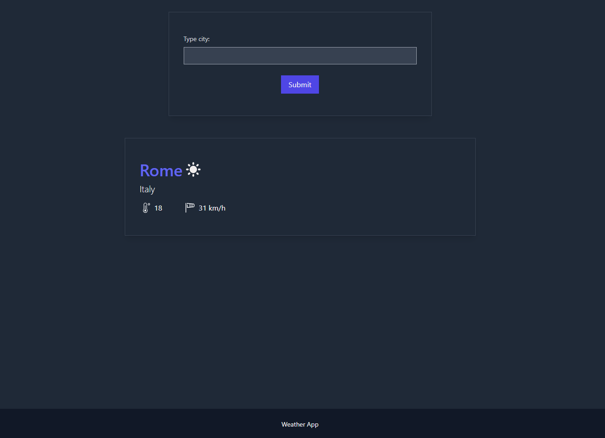
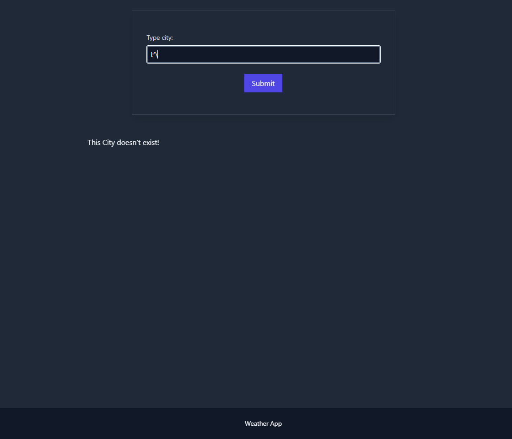

# Weather App

Application written to learn how to work with API, Vue and Tailwind. The user can enter any city and then press the "Submit" button or press enter, then a query is sent to the API and  if such a city exists, he should receive  information about the weather in that place

## Tech. Stack

<ul>
    <li>Vue</li>
    <li>Tailwind</li>
    <li>HTML</li>
    <li>Vite</li>
    <li>Pinia</li>
</ul>

## App preview

Here you can see how app looks like:

example of working correct result:

example when someone will type city/place which doesn't exist:

